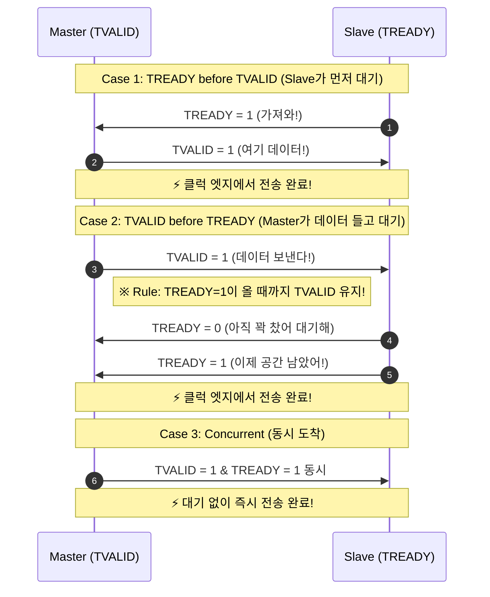

# AXI4-Stream Protocol Notes

## 1. AXI4 / AXI4-Lite / AXI4-Stream 의 핵심 차이점
AMBA 프로토콜에는 크게 3가지 AXI 인터페이스가 존재하며, 사용 목적이 완전히 다릅니다.

| 특징 | AXI4 (Full) | AXI4-Lite | AXI4-Stream |
|:---|:---|:---|:---|
| **목적** | 대용량 메모리(DDR 등) 고속 접근 | 간단한 제어 레지스터 설정 | 연속적인 데이터 스트리밍 (오디오, 비디오, 패킷) |
| **주소(Address)** | 있음 (Memory-Mapped) | 있음 (Memory-Mapped) | **없음** (주소라는 개념 자체가 없음) |
| **채널 구성** | 5개 채널 (AR, R, AW, W, B) | 5개 채널 (AR, R, AW, W, B) | **1개 채널** (단방향 Master -> Slave) |
| **Burst 전송** | 지원 (한 번의 주소로 여러 데이터 전송) | 미지원 (1 Address = 1 Data) | 무제한 (TLAST로 패킷 경계만 구분) |
| **비유하자면?** | 트럭 대량 물류 배송 | 우편함 단건 편지 배송 | **수도관 (물이 콸콸 흐름)** |

📌 **AXI-Stream만의 특징 요약**: 
주소가 없기 때문에 "**어디에** 데이터를 쓴다"가 아니라, "**어떤** 데이터를 물 흐르듯 흘려보낸다"에 집중합니다. 따라서 복잡한 5개 채널 구조 대신, 오직 **데이터를 보내는 마스터(Source)**와 **받는 슬레이브(Destination)** 간의 단방향 Handshake 구조를 가집니다.

---

## 2. Handshake Mechanism (TVALID & TREADY)
- 데이터 전송은 클럭의 Rising Edge에서 TVALID와 TREADY가 모두 High(1)일 때 발생한다.
- **절대적 룰**: 한 번 TVALID가 1이 되어 데이터 전송을 시도했다면, TREADY가 1이 되어 전송이 완료될 때까지 TVALID를 0으로 내리거나 TDATA를 변경해서는 안 된다.
- **Back-pressure**: Slave가 데이터를 받을 준비가 되지 않았다면 TREADY를 0으로 내려 데이터 유입을 막을 수 있다.

### ⏱️ 타이밍 다이어그램 (Handshake)
아래 다이어그램은 공식 스펙에서 가장 중요하게 다루는 3가지 Handshake 케이스를 시퀀스로 도식화한 것입니다.

> **[참조] 📚 공식 레퍼런스 문서**
> - [ARM IHI 0051 (AMBA 4 AXI4-Stream Protocol Spec)](https://developer.arm.com/documentation/ihi0051/latest)
> - [AMD UG1037 (AXI Reference Guide)](https://docs.amd.com/v/u/en-US/ug1037-vivado-axi-reference-guide)

## 3. Key Signals
| Signal | Direction | Description |
|:---|:---|:---|
| ACLK | Input | 클럭 신호 |
| ARESETn | Input | Active-Low 리셋 신호 |
| TVALID | Master->Slave | Master 측의 유효 데이터 출력 플래그 |
| TREADY | Slave->Master | Slave 측의 데이터 수신 가능 플래그 |
| TDATA | Master->Slave | 전송되는 페이로드 (기본 32-bit 등) |
| TLAST | Master->Slave | 통신 패킷의 경계 (마지막 데이터)를 나타냄 |
| TKEEP | Master->Slave | Byte qualifier: 해당 바이트가 의미 있는 데이터(1)인지, 무시할 Null 바이트(0)인지 표기 |
| TSTRB | Master->Slave | Byte qualifier: Data 바이트(1) vs Position 바이트(0). (스트림에서는 주로 생략되거나 TKEEP와 유사한 역할로 대체되기도 함) |
| TUSER | Master->Slave | User-defined 라우팅 사이드밴드 신호 |
| TID | Master->Slave | 스트림 식별자 |
| TDEST | Master->Slave | 라우팅 목적지 주소 |

## 4. TKEEP vs TSTRB 주의사항
TKEEP는 실제 유효한 데이터가 쓰여 있는 바이트를 표시하기 위해 가장 많이 사용된다. 통신 패킷의 경우 마지막 전송 시 TDATA 전체 비트가 유효하지 않을 수 있으므로 (예: 32bit 버스에서 1바이트만 전송), 에러를 방지하기 위해 TKEEP 처리가 중요하다.

## 5. Common Pitfalls (초보자 흔한 실수)
1. TREADY가 0인데 TVALID 값을 0으로 내려버리는 프로토콜 위반.
2. `(TVALID == 1 && TREADY == 1)` 조건 교집합을 확인하지 않고 데이터를 막 캡처하거나 넘기는 오류.
3. 패킷 기반 시스템에서 패킷 경계를 구획하는 `TLAST` 신호를 누락하여 수신단 데드락을 유발.
